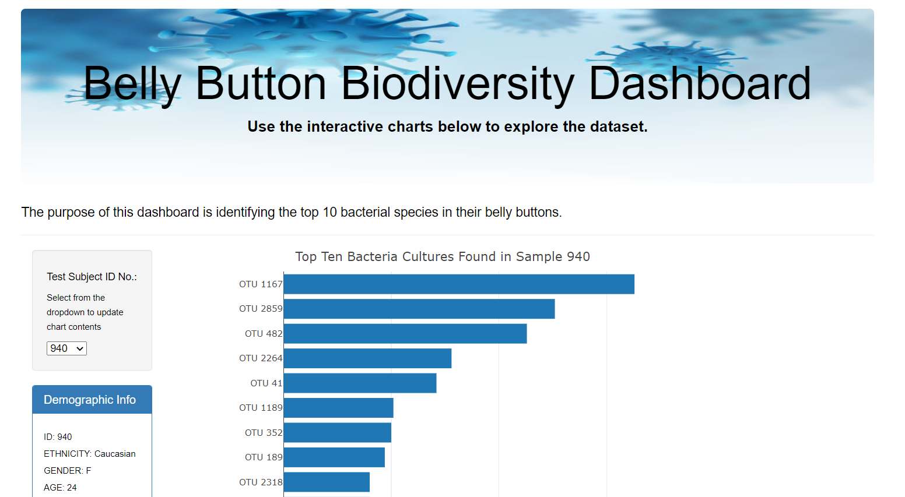

# Belly Button Biodiversity

[Deploy Webpage](https://github.com/Cindydidit/belly_button_biodiversity.git)

## Overview of Project  

The purpose of this project is to create an interactive dashboard in order to explore bacteria culture data with Bootstrap, CSS, D3.js, HTML, JavaScript, and Plotly. The data contains 153 subjects, along with bacteria cultures from their bellybuttons.
	

---

## Resource:

Data Sources: samples.json 

Tools: Bootstrap, CSS, D3.js, HTML, JavaScript, and PlotlyVisual Studio Code  
 
---

## Results and Summary: 

---
